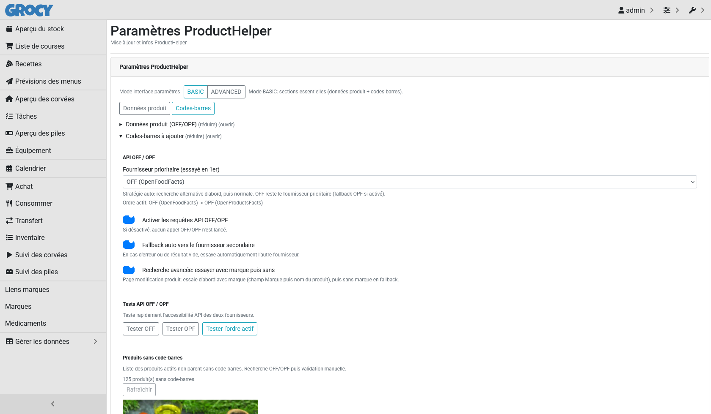
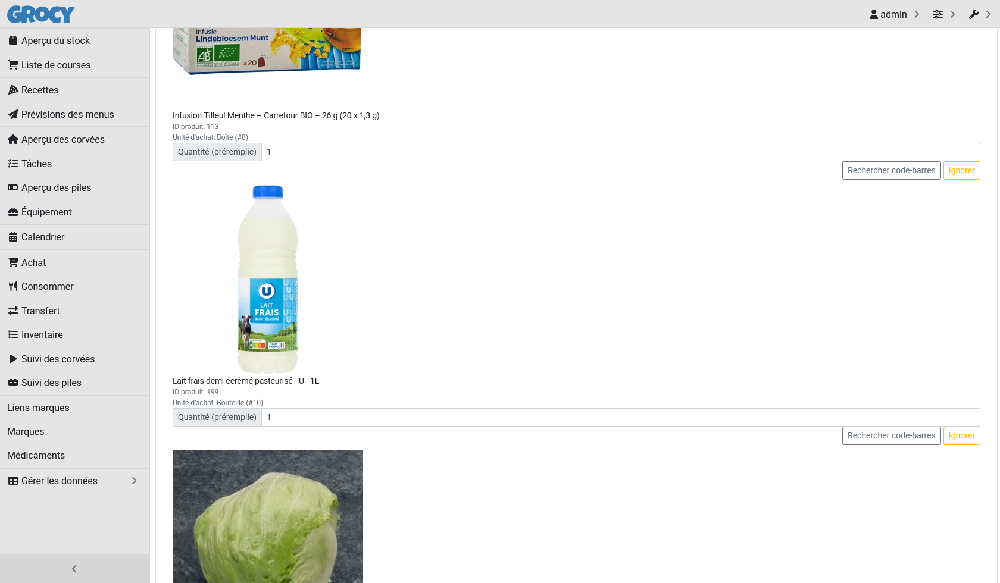
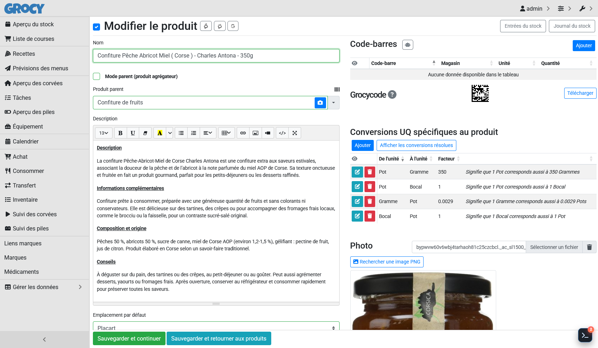

# ProductHelper for Grocy: practical product automation / ProductHelper pour Grocy : automatisation produit concrète

Hey Grocy folks / Salut la communauté Grocy

I’m sharing **ProductHelper**, an addon focused on speeding up **real product workflows**: barcode lookup, missing-barcode queue, brand/sub-brand logic, and product photo helpers.  
Je partage **ProductHelper**, un addon orienté **workflow terrain** pour aller plus vite sur les produits : recherche code-barres, file d’attente des codes manquants, logique marque/sous-marque, et aide photo.

- Repo / Dépôt: `https://github.com/Raph563/ProductHelper`
- NerdCore required / NerdCore requis: `https://github.com/Raph563/NerdCore`
- StatNerd optional / StatNerd optionnel: `https://github.com/Raph563/StatNerd`

## What it is / C’est quoi

**ProductHelper** is a frontend addon injected through Grocy `custom_js` (addon pack).  
**ProductHelper** est un addon frontend injecté via `custom_js` (pack addon).

It is designed for users with medium/large catalogs where manual barcode/data hygiene becomes expensive.  
Il est pensé pour les catalogues moyens/grands où la maintenance manuelle des fiches devient coûteuse.

## Practical features that save time / Fonctions vraiment utiles au quotidien

### 1) `/products` alert banner for missing barcodes / Banderole d’alerte sur `/products`

A top banner shows the **current count of active products missing barcodes** and a one-click shortcut to the barcode settings section.  
Une banderole en haut de `/products` affiche le **nombre actuel de produits actifs sans code-barres** avec un accès direct à la section de traitement.


### 2) Dedicated barcode settings UX (BASIC/ADVANCED) / UX dédiée codes-barres (BASIC/ADVANCED)

- New structured settings groups (`General`, `Product data`, `Barcodes`, `Visuals`, `Providers`, `Compatibility`, `Updates`)
- `BASIC` mode by default (focus on essential sections), `ADVANCED` for full control
- Direct deep-link support: `/stocksettings?producthelper=1&producthelperTab=barcodes`
- Non-AI toggles/selects use practical autosave behavior



Small focused crop for mode switch:


### 3) Missing-barcode dashboard with actionable cards / Dashboard “codes-barres manquants” avec fiches actionnables

In ProductHelper settings, you get cards for **active non-parent products without barcode**.  
Dans les paramètres ProductHelper, des fiches listent les **produits actifs non-parents sans code-barres**.

Per-card actions:

- editable quantity (purchase -> stock factor prefill)
- OFF/OPF lookup
- explicit user validation before writing barcode
- `Ignore` / `Restore` workflow (global persistent state)



### 4) Product edit helpers (barcode + photo) / Aides en édition produit (code-barres + photo)

On product edit pages, ProductHelper adds practical shortcuts around barcode/photo tasks:

- OFF/OPF helper buttons
- quick photo search helpers
- safer guided flow for data completion



### 5) OFF/OPF lookup logic with brand-first fallback / Stratégie OFF/OPF avec fallback marque

Barcode lookup uses a robust strategy:

- try advanced lookup **with brand hint first** (product brand field or parsed from product name pattern)
- if no good result, retry **without brand**
- keep provider fallback chain (**OFF + OPF**) for resilience

This reduces false negatives while keeping explicit validation before create.  
Cette approche réduit les “non trouvés” tout en gardant une validation explicite avant création.

## Safety guardrails / Garde-fous

Before creating a barcode, ProductHelper checks:

- product still active
- product not parent-mode
- purchase unit exists
- no existing barcode duplication

No silent auto-create: user confirmation is required.  
Pas de création silencieuse : confirmation utilisateur obligatoire.

## Brand and sub-brand data model / Modèle marque et sous-marque

For users managing many brands:

- source remains product userfield `Marque`
- sync into `Marques` (with `logo_marque`)
- `Liens_marques` entity for parent/sub-brand links (`Marque_parente`, `Sous_marque`, `Actif`)
- auto-fill logic in product forms when active links exist

## Install / Installation

### Requirement / Prérequis

Install **NerdCore** first, then ProductHelper.  
Installer **NerdCore** d’abord, puis ProductHelper.

### Windows (PowerShell)

```powershell
cd addon\scripts
.\install.ps1 -GrocyConfigPath "C:\path\to\grocy\config"
```

### Linux / macOS

```bash
cd addon/scripts
./install.sh /path/to/grocy/config
```

## Update from GitHub releases / Mise à jour via releases GitHub

### Windows (PowerShell)

```powershell
cd addon\scripts
.\update-from-github.ps1 -GrocyConfigPath "C:\path\to\grocy\config"
```

### Linux / macOS

```bash
cd addon/scripts
./update-from-github.sh --config /path/to/grocy/config
```

## Uninstall / Désinstallation

Use uninstall scripts to rollback cleanly and restore composed `custom_js.html` backups when available.  
Utiliser les scripts uninstall pour rollback proprement et restaurer les backups de `custom_js.html` quand disponibles.

## Runtime files (FYI) / Fichiers runtime (info)

- `config/data/custom_js_product_helper.html`
- `config/data/producthelper-addon-state.json`
- `config/data/custom_js.html`

## Feedback welcome / Retours bienvenus

If you test it, share your workflow and edge cases:

- scanner-first vs manual-first
- naming patterns (`name - brand - quantity`)
- large DB performance
- OFF/OPF hit-rate quality

Si tu testes, je prends volontiers tes retours sur ton workflow et tes cas limites.